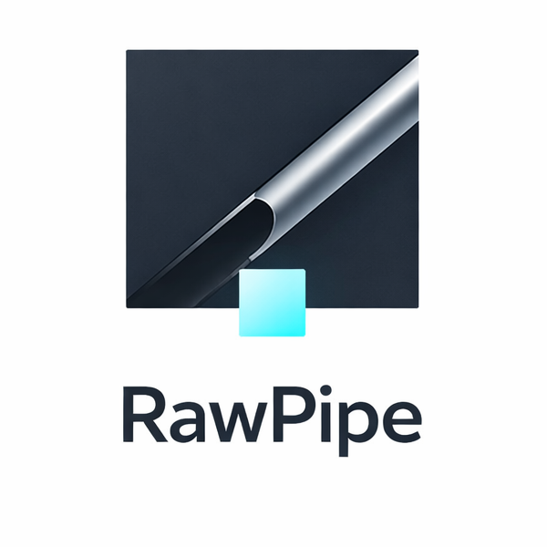

<p align="center">
  
</p>

<h1 align="center">RawPipe</h1>

<p align="center">
  <strong>从快门到交付，一条管道搞定。</strong><br/>
  <sub>为摄影师 · 设计师 · 模特打造的自动化影像交付引擎</sub>
</p>

<!-- ═══════════════════════ 技术栈徽章 ═══════════════════════ -->

<p align="center">
  
  
  
  
  
  
</p>


<!-- ═══════════════════════ 状态徽章 ═══════════════════════ -->

<p align="center">
  
  
  
  
  
</p>

---

<br/>

## 🎯 RawPipe 能帮你做什么

<table>
<tr>
<td width="33%" valign="top">

### 📸 摄影师

你只管拍和修，剩下的交给 RawPipe：

- ✅ **自动处理 RAW 档** — 丢进文件夹，自动提取预览图
- ✅ **秒级交付** — 处理完即上传云端，生成交付链接
- ✅ **告别微信传图** — 不压画质，客户看到的就是你调的色
- ✅ **选片不再靠截图** — 客户用❤️标记，结果自动回传

</td>
<td width="33%" valign="top">

### 🎨 设计师

源文件不用传，预览一键送达：

- ✅ **PSD / AI 自动预览** — 不用开 Photoshop 也能看
- ✅ **独立交付通道** — 不跟日常聊天混在一起
- ✅ **版本不再靠命名** — 一个项目一个文件夹，自动归类
- ✅ **源文件安全** — 客户只能看预览图，拿不到原始文件

</td>
<td width="33%" valign="top">

### 🧍 模特 / 客户

打开链接就能选片，零门槛：

- ✅ **不用下载** — 浏览器直接看，秒开不等待
- ✅ **爱心选片** — 喜欢就点❤️，直觉操作
- ✅ **自动保存** — 关掉页面也不怕，选的片子都还在
- ✅ **原色预览** — 不压缩、不变色，所见即所得

</td>
</tr>
</table>

<br/>

---

<br/>

## ⚡ 核心功能

<table>
<tr>
<td width="50%">

### 📁 拖入即处理
把照片丢进文件夹，RawPipe 自动完成一切：
- **RAW** (`.arw` `.cr2` `.cr3` `.nef` `.raf` `.dng`) → 智能提取嵌入预览图
- **设计稿** (`.psd` `.ai`) → 自动提取缩略图
- **照片** (`.jpg` `.jpeg`) → 长边 2000px 高品质代理图
- **SHA256 去重**，绝不重复处理

</td>
<td width="50%">

### ☁️ 秒级云端交付
处理完成即刻自动上传：
- 全球边缘节点加速，客户秒开即看
- 私有桶存储，搜索引擎抓不到你的作品
- 自动生成交付链接，一键发给客户
- 多租户隔离，每位客户的文件互不可见

</td>
</tr>
<tr>
<td>

### ❤️ 爱心选片
客户收到链接后在浏览器中直接操作：
- 瀑布流浏览，原色预览不压缩
- 点击❤️标记喜欢的照片
- 选片结果自动保存，关页面也不丢
- 无需注册、无需下载，零门槛

</td>
<td>

### 🖥️ 实时监控面板
打开浏览器就能看到工作状态：
- 处理进度、上传状态、Worker 负载一目了然
- 一个文件夹 = 一个项目，自动归类
- 历史记录完整留存
- 嵌入式面板，不需要额外安装

</td>
</tr>
</table>

<br/>

---

<br/>

## 🏆 为什么选 RawPipe

| | 传统方式 | RawPipe |
|:---|:---------|:--------|
| **交付速度** | 手动导出 + 上传网盘 *(30min+)* | 拖入即交付 *(全自动)* |
| **画质保真** | 微信压缩 / 网盘限速 | 原色预览，全球 CDN 加速 |
| **选片体验** | 截图 + 口头描述 | ❤️ 一键爱心，记录留存 |
| **RAW 支持** | 手动开软件导出 | 自动提取嵌入预览 |
| **PSD / AI** | 必须装 Adobe 才能看 | 自动提取，浏览器直看 |
| **多客户管理** | 全靠命名大法 | 邀请制 · 多租户隔离 |
| **部署方式** | 安装一堆依赖 | **双击一个文件，搞定** |

<br/>

---

<br/>

## 🚀 快速开始

```
1. 下载  →  从 Releases 下载对应平台的可执行文件
2. 双击  →  打开 http://localhost:9800 查看面板
3. 丢图  →  把照片放进 watch_folder/
4. 分享  →  将生成的交付链接发给客户
```

> 💡 **单文件部署，离线优先。** 不需要 Docker、不需要数据库、不需要 Node.js。双击就跑。

<br/>

---

<br/>

## 🗺️ 工作流程

```
 你的照片          RawPipe 自动处理            客户端

 ┌─────────┐      ┌──────────────┐      ┌──────────────┐
 │  拖入    │─────→│  智能提取    │─────→│  打开链接    │
 │  照片    │      │  代理图      │      │  浏览选片    │
 └─────────┘      └──────┬───────┘      └──────┬───────┘
                         │                      │
                         ▼                      ▼
                  ┌──────────────┐      ┌──────────────┐
                  │  云端上传    │      │  ❤️ 爱心标记  │
                  │  生成链接    │      │  结果回传     │
                  └──────────────┘      └──────────────┘
```

<br/>

---

<br/>

## 🔒 关于本仓库

本仓库为 **RawPipe 产品宣传页**。核心源代码为闭源商业软件，不在此仓库中。

如需试用或商业合作，请联系：

- 📧 Email: [kai@kaithe.world](mailto:kai@kaithe.world)

<br/>

---

<p align="center">
  <sub>© 2026 Kai-Kai. All Rights Reserved.</sub><br/>
  <sub>Made with ☕ for creative professionals.</sub>
</p>
